# Software Development Flowchart
## TuroArnis Development Lifecycle

---

## 1. HIGH-LEVEL DEVELOPMENT PIPELINE

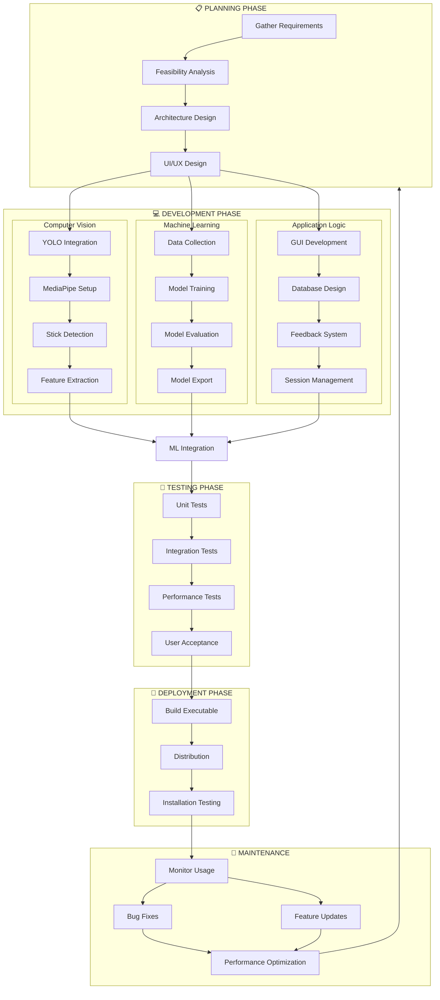

---

## 2. DETAILED DEVELOPMENT WORKFLOW

```mermaid
flowchart LR
    START([Start]) --> IDEAS{Project Ideas}
    
    IDEAS -->|Selected| SCOPE[Define Scope]
    SCOPE --> REQ[Requirements Analysis]
    
    REQ --> TECH{Technology Stack}
    TECH -->|Python| PY[Python 3.11]
    TECH -->|CV| CV_LIB[OpenCV + MediaPipe]
    TECH -->|ML| ML_LIB[PyTorch + PyG]
    TECH -->|GUI| GUI_LIB[CustomTkinter]
    
    PY & CV_LIB & ML_LIB & GUI_LIB --> SETUP[Environment Setup]
    
    SETUP --> PARALLEL_DEV{Parallel Development}
    
    PARALLEL_DEV -->|Track 1| CV_DEV[Computer Vision]
    PARALLEL_DEV -->|Track 2| ML_DEV[ML Models]
    PARALLEL_DEV -->|Track 3| UI_DEV[User Interface]
    
    %% Computer Vision Track
    CV_DEV --> YOLO_DEV[YOLO Person Detection]
    YOLO_DEV --> STICK_DEV[YOLO Stick Detection]
    STICK_DEV --> POSE_DEV[MediaPipe Pose]
    POSE_DEV --> FEAT_DEV[Feature Engineering]
    FEAT_DEV --> CV_INT[CV Integration]
    
    %% ML Track
    ML_DEV --> DATA_COLL[Data Collection]
    DATA_COLL --> AUG[Data Augmentation]
    AUG --> GCN_TRAIN[GCN Training]
    GCN_TRAIN --> MODEL_EVAL[Model Evaluation]
    MODEL_EVAL -->|Not Good| TUNE[Hyperparameter Tuning]
    TUNE --> GCN_TRAIN
    MODEL_EVAL -->|Good| MODEL_EXPORT[Export .pth Models]
    MODEL_EXPORT --> ML_INT[ML Integration]
    
    %% UI Track
    UI_DEV --> WIREFRAME[Wireframe Design]
    WIREFRAME --> GUI_IMPL[GUI Implementation]
    GUI_IMPL --> DB_DESIGN[Database Design]
    DB_DESIGN --> FEED_IMPL[Feedback Display]
    FEED_IMPL --> SESSION_IMPL[Session Logic]
    SESSION_IMPL --> UI_INT[UI Integration]
    
    CV_INT & ML_INT & UI_INT --> MERGE[Merge Components]
    
    MERGE --> BUILD_DEV[Build Development Version]
    BUILD_DEV --> TEST{Testing}
    
    TEST -->|Fail| DEBUG[Debug Issues]
    DEBUG --> TEST
    
    TEST -->|Pass| TEST_CATEGORIES[Test Categories]
    
    subgraph TESTS["Testing Types"]
        TEST_CATEGORIES --> UNIT_T[Unit Tests]
        TEST_CATEGORIES --> INT_T[Integration Tests]
        TEST_CATEGORIES --> PERF_T[Performance Tests]
        TEST_CATEGORIES --> USER_T[User Testing]
    end
    
    UNIT_T & INT_T & PERF_T & USER_T --> RELEASE{Release Ready?}
    
    RELEASE -->|No| CRITICAL[Critical Issues?]
    CRITICAL -->|Yes| HOTFIX[Hotfix]
    HOTFIX --> BUILD_DEV
    CRITICAL -->|No| BACKLOG[Add to Backlog]
    BACKLOG --> BUILD_DEV
    
    RELEASE -->|Yes| PACKAGE[Package Application]
    PACKAGE --> PYINSTALLER[PyInstaller Build]
    PYINSTALLER --> DIST_PACK[Create Distribution]
    DIST_PACK --> RELEASE_NOTES[Write Release Notes]
    RELEASE_NOTES --> DEPLOY[Deploy]
    
    DEPLOY --> MONITOR[Monitor & Collect Feedback]
    MONITOR --> MAINTENANCE{Maintenance Mode}
    
    MAINTENANCE --> BUG_FIX[Bug Fixes]
    MAINTENANCE --> FEATURE[New Features]
    MAINTENANCE --> OPTIMIZE[Optimization]
    
    BUG_FIX & FEATURE & OPTIMIZE --> VERSION_BUMP[Version Update]
    VERSION_BUMP --> REQ
    
    DEPLOY --> END([End])
```

---

## 3. ITERATIVE DEVELOPMENT CYCLE

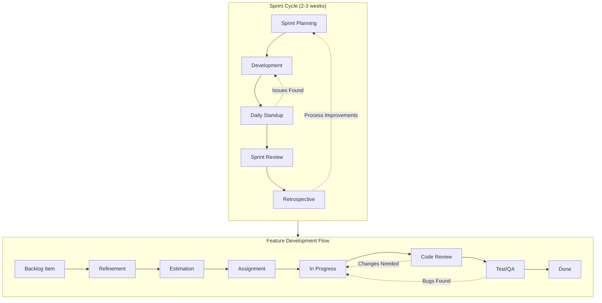

---

## 4. FEATURE IMPLEMENTATION FLOW

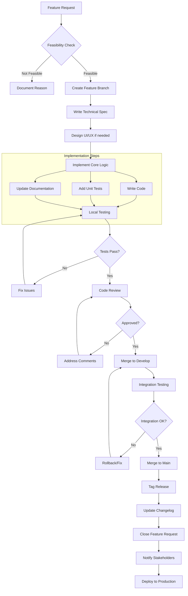

---

## 5. BUG FIX WORKFLOW

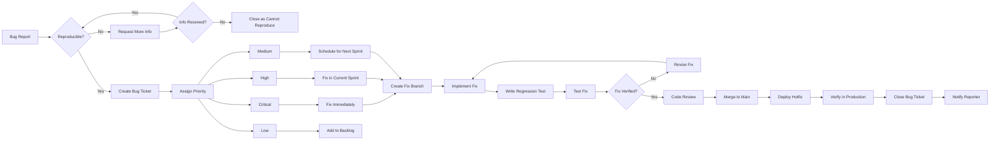

---

## 6. ML MODEL DEVELOPMENT FLOW

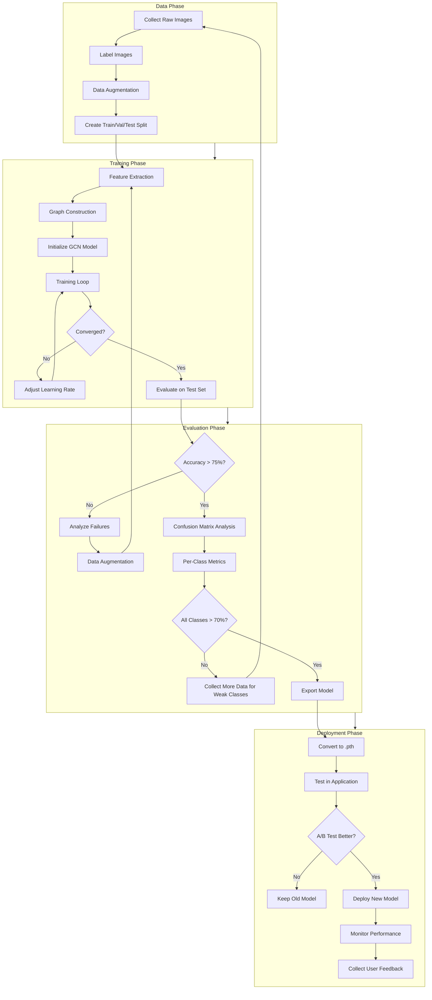

---

## 7. RELEASE MANAGEMENT FLOW

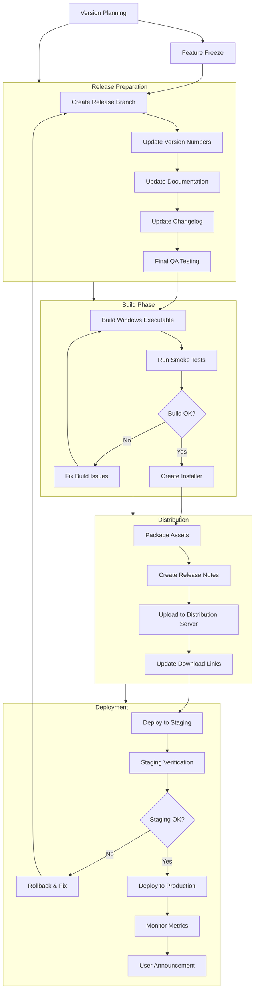

---

## 8. GIT WORKFLOW

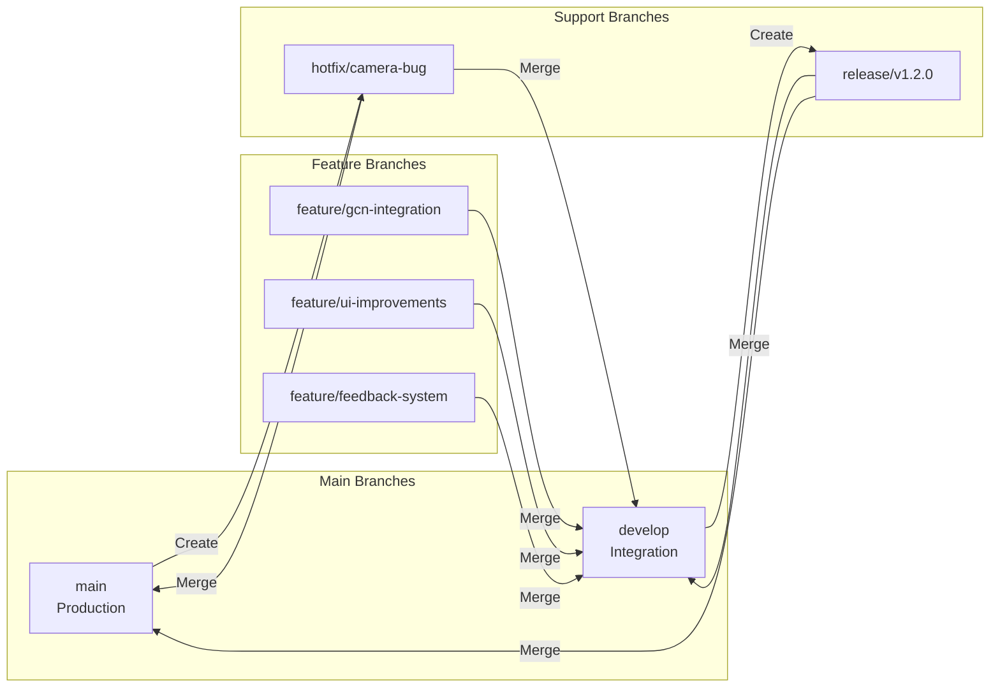

---

## 9. TESTING PYRAMID

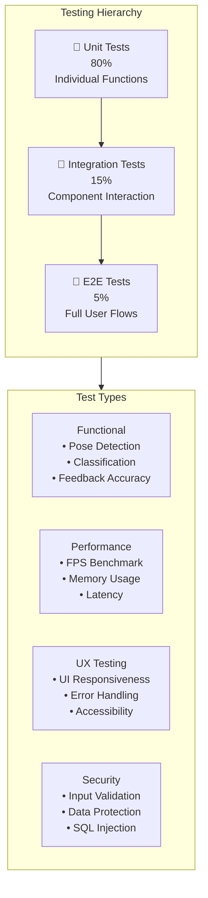

---

## 10. CONTINUOUS INTEGRATION PIPELINE

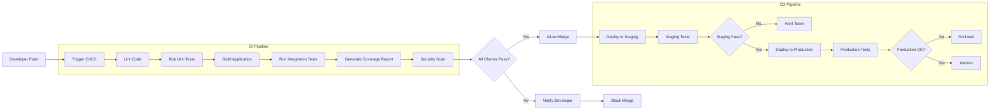

---

## 11. DEVELOPMENT PHASES TIMELINE

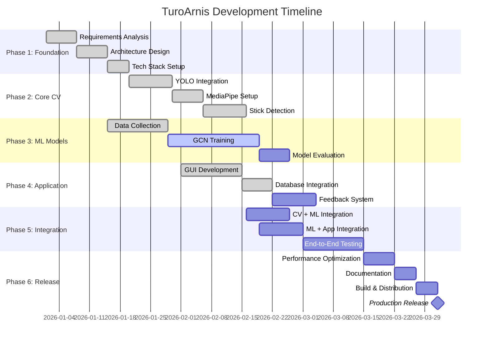

---

## 12. DECISION FLOWCHARTS

### When to Use Which Model?

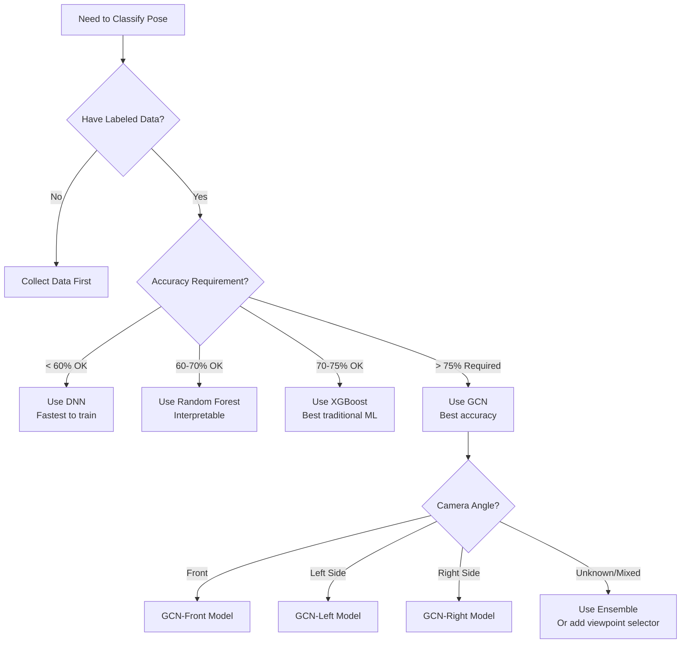

### When to Deploy?

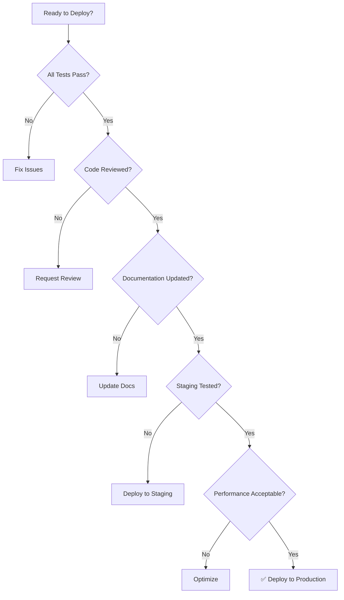

---

## 13. QUALITY GATES

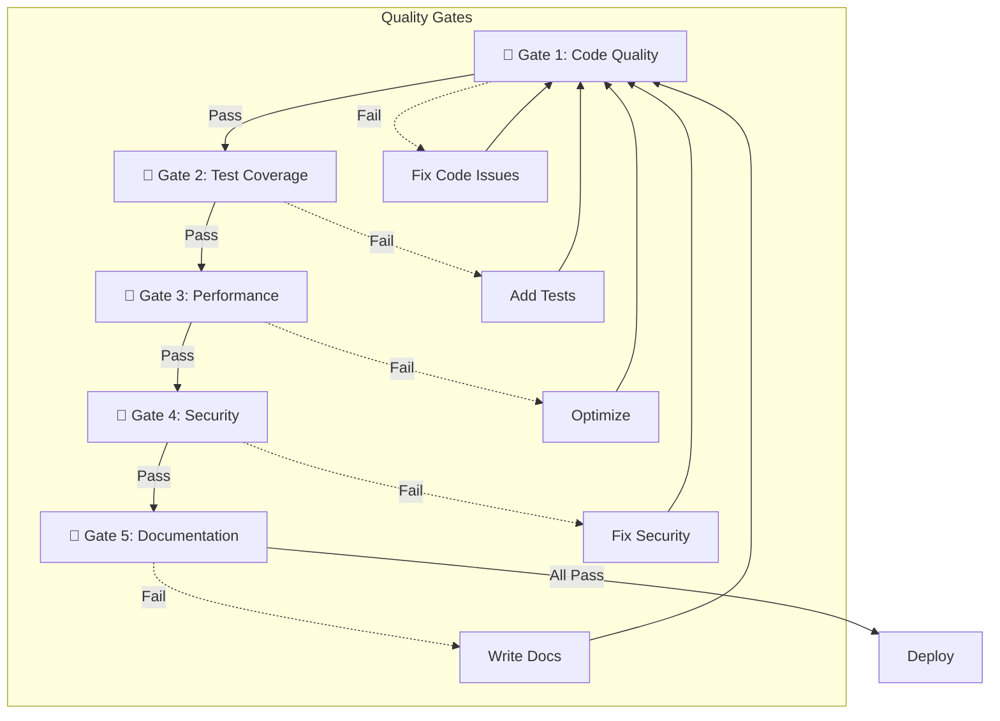

---

## Key Principles

1. **Iterative Development**: Build → Test → Feedback → Improve
2. **Parallel Tracks**: CV, ML, and UI can be developed simultaneously
3. **Fail Fast**: Detect issues early through automated testing
4. **Version Control**: All changes go through Git with proper branching
5. **Quality First**: No deployment without passing all quality gates
6. **User Feedback**: Continuous feedback loop drives improvements
7. **Documentation**: Code and processes must be documented
8. **Automation**: CI/CD pipeline automates repetitive tasks

---

*This flowchart provides a complete roadmap for developing, testing, and deploying TuroArnis.*
