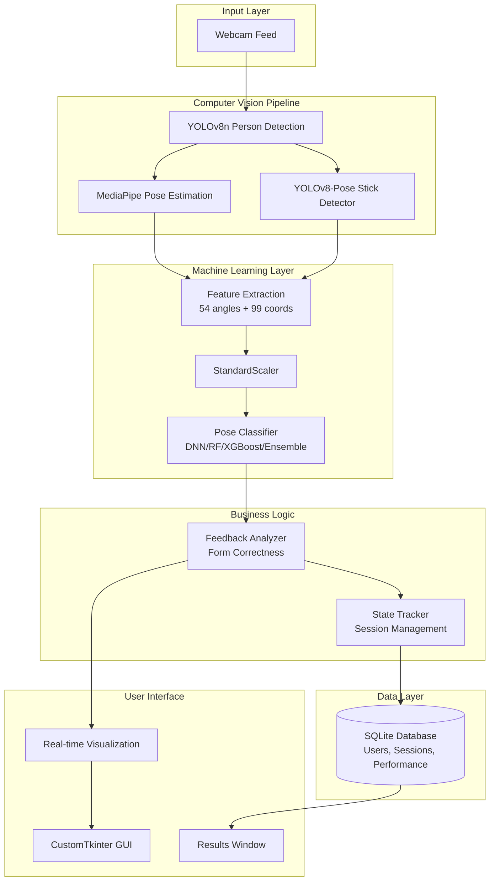

# TuroArnis - Implementation Plan

## Project Overview

**TuroArnis** is a real-time Arnis (Filipino martial arts) pose classification desktop application that provides instant feedback on form correctness during practice sessions. The system uses computer vision and machine learning to analyze user poses captured via webcam and compare them against 13 correct Arnis stances.

### Core Capabilities
- Real-time pose detection and classification (10 FPS)
- Stick detection using custom YOLOv8-Pose model
- Multi-user session tracking and performance analytics
- Detailed feedback on joint angles and form correctness
- Historical performance visualization and reporting

---

## System Architecture

### High-Level Component Diagram



---

## Technology Stack

### Core Dependencies

| Component | Technology | Version | Purpose |
|-----------|-----------|---------|---------|
| **GUI Framework** | CustomTkinter | Latest | Modern desktop UI with light theme |
| **Computer Vision** | MediaPipe | 0.10.14 | 33-point pose landmark detection |
| **Object Detection** | Ultralytics YOLO | Latest | Person tracking + stick detection |
| **ML Framework** | TensorFlow/Keras | 2.x/3.x | DNN model inference |
| **ML Models** | scikit-learn | Latest | Random Forest, XGBoost |
| **Database** | SQLite | Built-in | User sessions and performance data |
| **Image Processing** | OpenCV | Latest | Frame processing and visualization |
| **Numerical Computing** | NumPy | Latest | Feature calculations |

### Model Architecture Options

The application supports **4 model types** that can be swapped via `active_model.json`:

1. **DNN (Deep Neural Network)**
   - Architecture: 256 → 128 → 64 → 32 → softmax
   - Input: 99 normalized coordinates
   - Training: Adam optimizer, early stopping, dropout regularization

2. **Random Forest**
   - Estimators: 200-500 trees
   - Input: 54 engineered angle features
   - Advantages: Fast inference, interpretable feature importance

3. **XGBoost**
   - Gradient boosting with L1/L2 regularization
   - Input: 54 engineered angle features
   - Advantages: High accuracy on tabular data

4. **Ensemble (Recommended)**
   - Combines DNN + RF + XGBoost via soft/hard voting
   - Expected accuracy gain: +2-10% over best single model
   - Configuration: `ensemble_config.json`

---

## Component Breakdown

### 1. Computer Vision Pipeline

#### File: [`pose_analyzer.py`](file:///c:/Users/HP/Documents/GitHub/TuroArnis/app/computer_vision/pose_analyzer.py)

**Responsibilities:**
- Person detection and tracking (ByteTrack algorithm)
- MediaPipe pose landmark extraction (33 keypoints)
- Stick detection using custom YOLOv8-Pose model (2 keypoints: grip + tip)
- Feature extraction (joint angles, distances, symmetry metrics)
- ML model inference with caching for performance

**Key Methods:**
- `process_frame()`: Main processing loop with frame skipping optimization
- `_detect_stick_with_yolo()`: Stick endpoint detection with confidence filtering
- `_calculate_all_angles_3d()`: Extract 6 joint angles from 3D landmarks
- `_smooth_stick_keypoints()`: Temporal smoothing buffer (5 frames)

**Performance Optimizations:**
- Frame skipping: ML inference every 8 frames, stick detection every 4 frames
- Cached predictions reused on skipped frames
- MediaPipe `model_complexity=1` for CPU efficiency
- YOLO tracking with ByteTrack for stable person IDs

#### File: [`feedback_analyzer.py`](file:///c:/Users/HP/Documents/GitHub/TuroArnis/app/computer_vision/feedback_analyzer.py)

**Responsibilities:**
- Compare detected pose against target form
- Generate prioritized feedback messages (max 3 displayed)
- Calculate form correctness based on joint angle thresholds
- Severity classification (critical/warning/info)

---

### 2. Desktop Application

#### File: [`main_app.py`](file:///c:/Users/HP/Documents/GitHub/TuroArnis/app/main_app.py)

**Responsibilities:**
- Main application window and UI layout
- Video feed rendering with real-time overlays
- User session management (start/end sessions)
- State tracking for pose correctness (min 10 frames before saving)
- Keyboard shortcuts (Space: toggle session, Ctrl+R: results, F11: fullscreen)

**UI Components:**
1. **Video Canvas**: Real-time camera feed with pose overlays
2. **Controls Panel**: 
   - Session info (user, timer, status)
   - Form selector (13 Arnis stances)
   - System status (confidence, camera, model)
   - Activity log
3. **Results Window**: Historical performance analytics

**State Management:**
- `MIN_STATE_FRAMES = 10`: Minimum frames to confirm pose state
- `MAX_STATE_DURATION = 300`: Timeout for stuck incorrect poses
- Session auto-start when form is selected
- Performance saved only on state transitions (correct ↔ incorrect)

---

### 3. Database Layer

#### File: [`db_manager.py`](file:///c:/Users/HP/Documents/GitHub/TuroArnis/app/database/db_manager.py)

**Schema:**

```sql
-- Users table
CREATE TABLE users (
    id INTEGER PRIMARY KEY,
    name TEXT UNIQUE,
    created_at TIMESTAMP,
    is_active BOOLEAN
);

-- Sessions table
CREATE TABLE sessions (
    id INTEGER PRIMARY KEY,
    user_id INTEGER,
    target_pose TEXT,
    start_time TIMESTAMP,
    end_time TIMESTAMP,
    FOREIGN KEY (user_id) REFERENCES users(id)
);

-- Performance table
CREATE TABLE performance (
    id INTEGER PRIMARY KEY,
    session_id INTEGER,
    user_id INTEGER,
    timestamp TIMESTAMP,
    pose_detected TEXT,
    confidence REAL,
    is_correct BOOLEAN,
    joint_angles TEXT,  -- JSON
    grip_angle REAL,
    stick_detected BOOLEAN,
    FOREIGN KEY (session_id) REFERENCES sessions(id)
);
```

**Key Methods:**
- `create_user()`: Add new user
- `start_session()`: Begin practice session
- `save_performance()`: Log pose attempt
- `get_session_summary()`: Calculate accuracy stats
- `get_user_history()`: Retrieve historical data for charts

---

### 4. Model Management

#### File: [`active_model.json`](file:///c:/Users/HP/Documents/GitHub/TuroArnis/app/models/active_model.json)

**Purpose:** Configuration file specifying which model to load at runtime

**Structure:**
```json
{
    "version": "v023_ensemble_soft_nongs",
    "model_path": "v023_ensemble_soft_nongs/model.keras",
    "encoder_path": "v023_ensemble_soft_nongs/label_encoder.joblib",
    "scaler_path": "v023_ensemble_soft_nongs/scaler.joblib",
    "model_type": "ensemble",
    "created_at": "2026-02-09T16:00:00Z"
}
```

**Model Versioning:**
- Each model stored in `app/models/<version_name>/`
- Includes: model file, encoder, scaler, metadata.json
- Ensemble models also include `ensemble_config.json`

---

## Arnis Stance Classes

The system classifies **13 Arnis stances**:

| Class ID | Stance Name | Description |
|----------|-------------|-------------|
| 1 | `crown_thrust_correct` | Overhead thrust targeting crown |
| 2 | `left_chest_thrust_correct` | Thrust to left chest area |
| 3 | `left_elbow_block_correct` | Defensive block with left elbow |
| 4 | `left_eye_thrust_correct` | Thrust targeting left eye |
| 5 | `left_knee_block_correct` | Low block protecting left knee |
| 6 | `left_temple_block_correct` | High block protecting left temple |
| 7 | `neutral_stance` | Ready position |
| 8 | `right_chest_thrust_correct` | Thrust to right chest area |
| 9 | `right_elbow_block_correct` | Defensive block with right elbow |
| 10 | `right_eye_thrust_correct` | Thrust targeting right eye |
| 11 | `right_knee_block_correct` | Low block protecting right knee |
| 12 | `right_temple_block_correct` | High block protecting right temple |
| 13 | `solar_plexus_thrust_correct` | Central thrust to solar plexus |

---

## Current Project State

### ✅ Completed Components

1. **Desktop Application**
   - Fully functional GUI with CustomTkinter
   - Real-time video processing at ~10 FPS
   - Multi-user support with session tracking
   - Performance analytics and historical charts

2. **Computer Vision Pipeline**
   - MediaPipe pose detection (33 landmarks)
   - Custom YOLOv8-Pose stick detector trained on Arnis sticks
   - ByteTrack person tracking for stable IDs
   - Optimized frame skipping for CPU efficiency

3. **Machine Learning Models**
   - DNN baseline model (55% accuracy)
   - Random Forest and XGBoost alternatives
   - Ensemble voting system (soft/hard voting)
   - Model versioning and hot-swapping

4. **Database System**
   - SQLite schema for users, sessions, performance
   - Session summary statistics
   - Historical data retrieval for analytics

5. **Deployment Package** (in `deployment_package/`)
   - Hybrid GCN V2 specialist models (front/left/right viewpoints)
   - YOLO stick detector weights
   - Implementation guide and README
   - Requirements.txt with locked versions

### 🚧 Known Issues & Limitations

1. **Model Accuracy**
   - Current best model: ~55-65% accuracy
   - Similar poses (e.g., left vs right thrusts) often confused
   - Viewpoint sensitivity (front vs side angles)

2. **Performance Bottlenecks**
   - YOLO stick detector: ~60ms per frame (main bottleneck)
   - Full pipeline limited to ~10 FPS on CPU
   - No GPU acceleration in current deployment

3. **Stick Detection**
   - Requires good lighting and contrast
   - Confidence threshold filtering needed (>0.4)
   - Occasional false negatives in complex backgrounds

4. **User Experience**
   - No real-time guidance on camera positioning
   - Limited feedback on why pose is incorrect
   - No progress tracking across multiple sessions

---

## Development Workflow

### Adding a New Arnis Stance

1. **Data Collection**
   - Capture images of the new stance from multiple viewpoints
   - Organize in `data/raw/<stance_name>/` folder
   - Minimum 50-100 images per stance

2. **Data Augmentation**
   - Run augmentation script to generate 15 variations per image
   - Applies spatial, color, and camera simulation transforms

3. **Feature Extraction**
   - Process augmented images with MediaPipe
   - Extract 54 angle features or 99 coordinate features
   - Save to `data/processed/features.csv`

4. **Model Retraining**
   - Update class list in label encoder
   - Retrain model with new data
   - Evaluate on test set
   - Save new model version

5. **Update Application**
   - Add stance to `practice_stances` dictionary in `main_app.py`
   - Update feedback thresholds in `feedback_analyzer.py`
   - Test in real-time application

### Switching Active Model

```bash
# Option 1: Manual edit
# Edit app/models/active_model.json to point to desired version

# Option 2: Programmatic (if model manager exists)
python training/model_manager.py
# Select "Set active model" option
```

### Training a New Model

```bash
# DNN model
python training/training.py

# Random Forest / XGBoost
python training/training_alt.py

# Ensemble
python training/ensemble_model.py
```

---

## Deployment Package (Separate Repository)

### Location: `deployment_package/`

**Purpose:** Self-contained package for deploying Hybrid GCN V2 specialist models to a separate repository.

**Contents:**
- **Models**: 3 viewpoint-specific GCN models (front, left, right)
- **Weights**: YOLOv8-Pose stick detector (`best.pt`)
- **Source Code**: Model architecture, feature extraction utilities
- **Documentation**: Implementation plan, README, requirements.txt

**Key Difference from Main App:**
- Uses Graph Convolutional Networks (GCN) instead of DNN/RF/XGBoost
- Viewpoint-specific models (user manually selects camera angle)
- 35-node graph (33 MediaPipe + 2 stick keypoints)
- Hybrid features: node features + global similarity scores

> [!NOTE]
> The deployment package is a **separate implementation** from the main desktop app. It represents an alternative approach using GCN architecture for research purposes.

---

## File Structure Reference

```
TuroArnis/
├── app/
│   ├── main_app.py                    # Main desktop application
│   ├── main_image.py                  # Image testing utility
│   ├── main_video.py                  # Video testing utility
│   ├── computer_vision/
│   │   ├── pose_analyzer.py           # CV pipeline (MediaPipe + YOLO)
│   │   ├── feedback_analyzer.py       # Form correctness logic
│   │   └── frame_processor.py         # Frame processing utilities
│   ├── gui/
│   │   ├── results_window.py          # Performance analytics UI
│   │   ├── user_dialog.py             # User selection dialog
│   │   ├── toast.py                   # Toast notifications
│   │   └── loading_spinner.py         # Loading animations
│   ├── database/
│   │   └── db_manager.py              # SQLite database interface
│   ├── models/
│   │   ├── active_model.json          # Active model configuration
│   │   ├── v019_ang4_xgb/             # XGBoost model version
│   │   ├── v020_ang4_rf/              # Random Forest version
│   │   └── v023_ensemble_soft_nongs/  # Ensemble version
│   └── utils/
│       ├── resource_path.py           # PyInstaller resource helper
│       ├── device_manager.py          # GPU/CPU device selection
│       └── ensemble_model.py          # Ensemble classifier
├── deployment_package/                # GCN deployment package
│   ├── models/                        # Hybrid GCN V2 models
│   ├── weights/                       # YOLO stick detector
│   ├── src/                           # GCN source code
│   ├── docs/                          # Implementation plan
│   └── README.md                      # Package documentation
├── docs/
│   ├── TECHNICAL_REPORT.md            # ML pipeline documentation
│   ├── ensemble_guide.md              # Ensemble model guide
│   └── deployment/                    # Build instructions
├── runs/
│   └── pose/arnis_stick_detector/     # YOLO training artifacts
├── requirements.txt                   # Python dependencies
└── TuroArnis.spec                     # PyInstaller build spec
```

---

## Next Steps & Recommendations

### Immediate Priorities

1. **Improve Model Accuracy**
   - Collect more training data for confused classes
   - Experiment with viewpoint-specific models (like GCN approach)
   - Fine-tune ensemble weights based on validation set

2. **Optimize Performance**
   - Implement YOLO model quantization (INT8) for faster inference
   - Add GPU support detection and automatic fallback
   - Profile frame processing pipeline for bottlenecks

3. **Enhance User Experience**
   - Add camera positioning guide (distance, angle indicators)
   - Implement progressive feedback (beginner → advanced)
   - Add session goals and achievement tracking

### Future Enhancements

1. **Advanced Features**
   - Video recording of practice sessions
   - Side-by-side comparison with reference videos
   - Export performance reports (PDF/CSV)
   - Mobile app companion (view stats on phone)

2. **Model Improvements**
   - Temporal models (LSTM/Transformer) for movement sequences
   - Transfer learning from larger pose datasets
   - Active learning to identify hard examples

3. **Deployment**
   - Cloud-based inference option (reduce local compute)
   - Multi-camera support for 3D pose reconstruction
   - Integration with VR/AR for immersive training

---

## Verification Plan

### Manual Testing Checklist

> [!IMPORTANT]
> Since this is a **documentation-only** implementation plan (no code changes), verification focuses on confirming the plan accurately reflects the current codebase.

#### 1. Architecture Verification
- [ ] Confirm component diagram matches actual file structure
- [ ] Verify technology stack versions in `requirements.txt`
- [ ] Check model types listed in `app/models/` directory
- [ ] Validate database schema against `db_manager.py`

**How to verify:**
```bash
# Check file structure
ls -R app/

# Verify requirements
cat requirements.txt

# List model versions
ls app/models/

# Check database schema
sqlite3 app/turoarnis.db ".schema"
```

#### 2. Feature Completeness
- [ ] Test desktop application launches successfully
- [ ] Verify all 13 Arnis stances are selectable in GUI
- [ ] Confirm session tracking saves to database
- [ ] Test model switching via `active_model.json`

**How to verify:**
```bash
# Run application
python app/main_app.py

# In GUI:
# 1. Select a user
# 2. Choose an Arnis form from dropdown
# 3. Start session
# 4. Perform pose in front of camera
# 5. End session
# 6. Click "View All Results" to see database entries
```

#### 3. Deployment Package Validation
- [ ] Verify deployment package structure matches README
- [ ] Confirm GCN models exist in `deployment_package/models/`
- [ ] Check YOLO weights in `deployment_package/weights/`

**How to verify:**
```bash
# Check deployment package
ls deployment_package/models/
ls deployment_package/weights/
cat deployment_package/README.md
```

### Automated Tests

> [!NOTE]
> No automated tests currently exist in the repository. Future work should add:
> - Unit tests for feature extraction functions
> - Integration tests for database operations
> - End-to-end tests for pose classification pipeline

---

## Questions for User Review

> [!WARNING]
> **Critical Decisions Needed**

1. **Deployment Package Scope**
   - Should the implementation plan cover ONLY the main desktop app, or also include the GCN deployment package?
   - Current plan documents both - is this the desired scope?

2. **Model Strategy**
   - Should we prioritize improving the existing DNN/RF/XGBoost models, or migrate to the GCN approach?
   - The GCN models show promise with viewpoint specialization - worth integrating into main app?

3. **Performance vs. Accuracy Trade-off**
   - Current system runs at 10 FPS with ~55-65% accuracy
   - Would you prefer: (A) Faster inference (20+ FPS) with same accuracy, or (B) Higher accuracy (75%+) at current speed?

4. **Next Development Phase**
   - What should be the immediate next task after this plan is approved?
   - Options: Model improvement, UI enhancements, deployment optimization, or new features?

---

## Summary

This implementation plan documents the **TuroArnis** desktop application, a real-time Arnis pose classification system. The application successfully integrates:

- **Computer Vision**: MediaPipe + YOLO for pose and stick detection
- **Machine Learning**: Multiple model architectures (DNN, RF, XGBoost, Ensemble)
- **User Interface**: CustomTkinter desktop GUI with session management
- **Data Persistence**: SQLite database for performance tracking

The system is **production-ready** with room for accuracy improvements and performance optimizations. The deployment package provides an alternative GCN-based approach for research and comparison.

**Key Strengths:**
- Modular architecture with swappable ML models
- Real-time feedback at acceptable frame rates
- Comprehensive session tracking and analytics
- Well-documented codebase with clear separation of concerns

**Key Challenges:**
- Model accuracy plateau (~55-65%)
- CPU-bound performance limitations
- Stick detection reliability in varied lighting

**Recommended Path Forward:**
1. Validate this plan reflects current state accurately
2. Decide on model improvement strategy (ensemble tuning vs. GCN migration)
3. Implement performance optimizations (quantization, GPU support)
4. Enhance user experience with guided feedback
