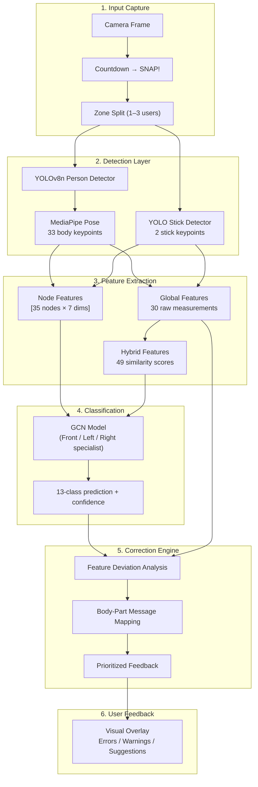
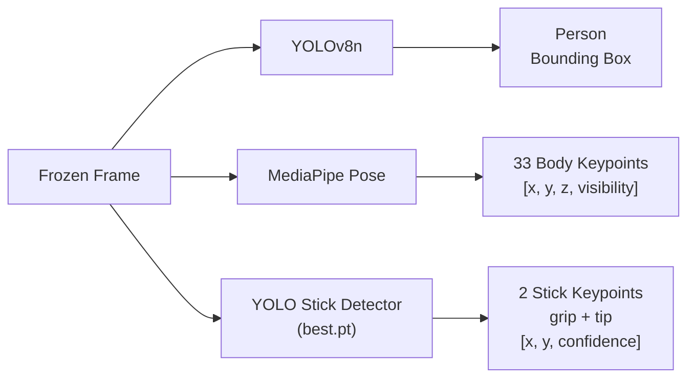
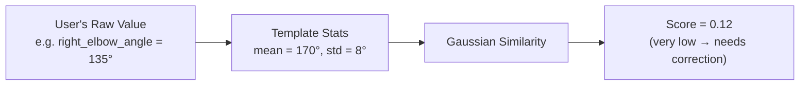
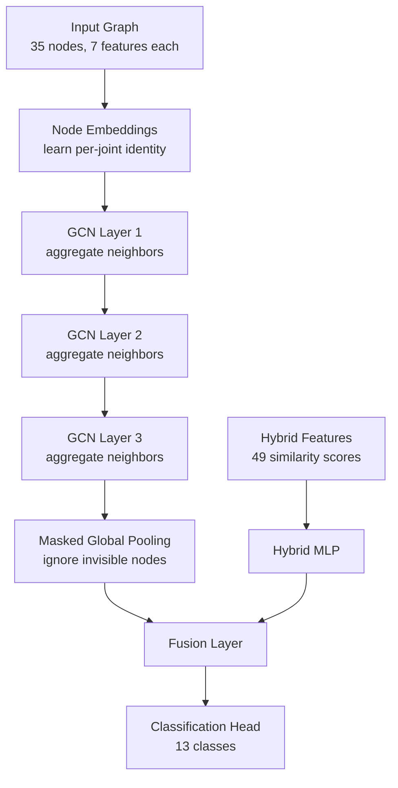
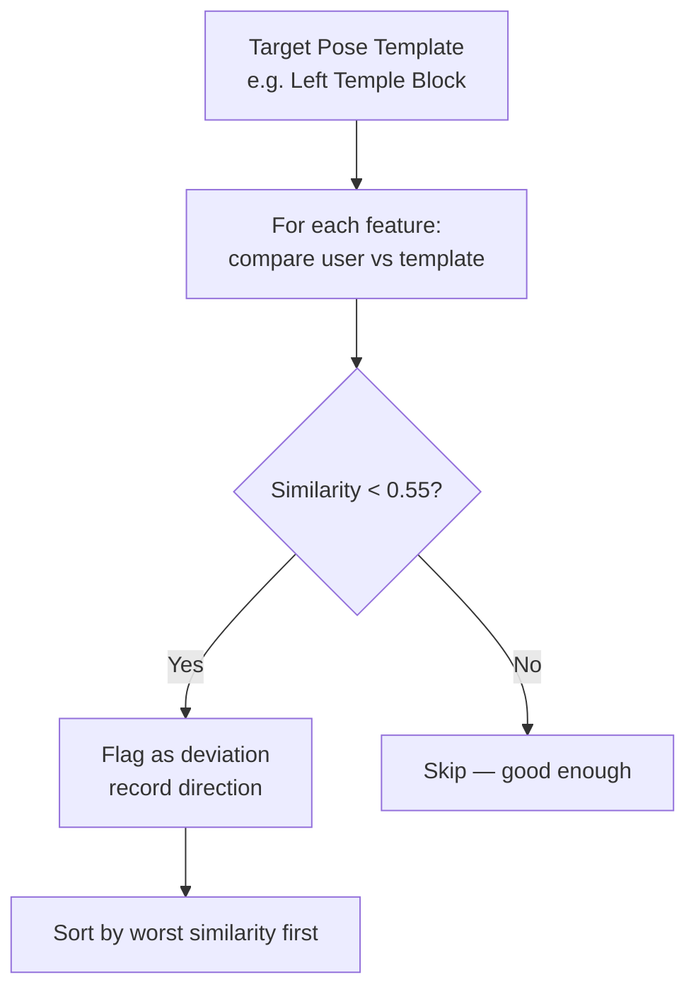
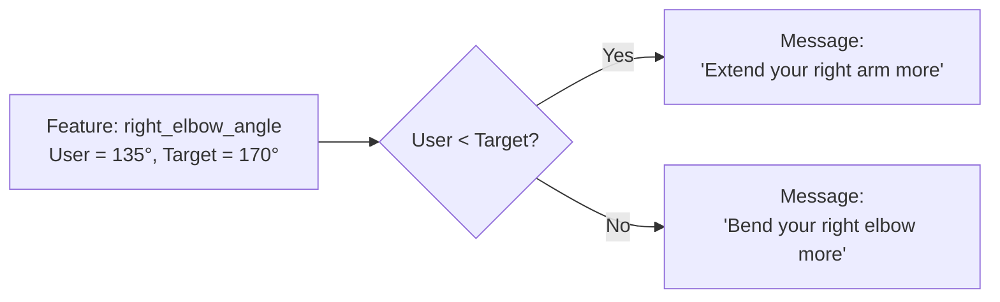
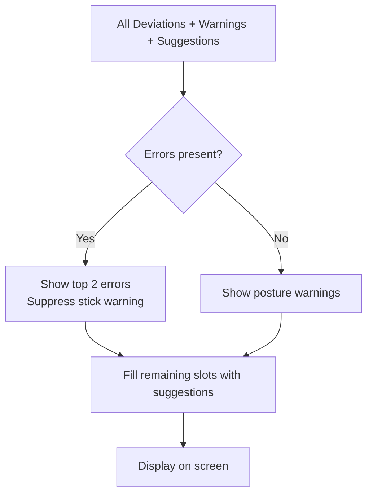
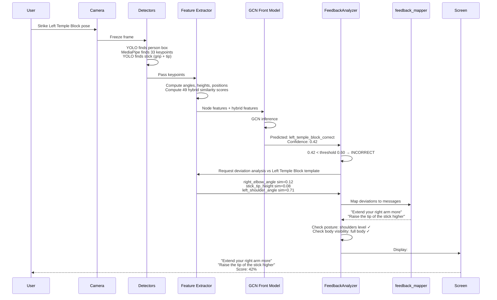
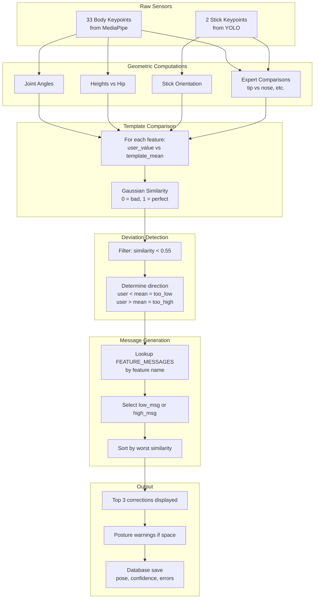

# TuroArnis: From Pose Detection to Corrective Feedback

## 1. Overview

TuroArnis is a real-time Arnis (Filipino martial arts) pose coaching system. When a user strikes a pose in front of the camera, the system does not just say **"wrong"** — it pinpoints **exactly which joint, limb, or stick angle is off** and tells the user how to fix it.

This document walks through the full pipeline, with a deep focus on **how the system isolates individual body parts for correction**.

---

## 2. High-Level Pipeline



---

## 3. Stage-by-Stage Breakdown

### 3.1 Snapshot & Zone Capture

When the user is ready, a countdown runs. At `0`, the current frame is **frozen** and sent to analysis.

| Scenario | Action |
|---|---|
| Single user | Entire frame analyzed as one zone |
| 2–3 users | Frame split vertically; each zone analyzed independently with its own viewpoint model |

The viewpoint (`front`, `left`, `right`) is selected by the user during setup and determines which specialist GCN model is loaded.

---

### 3.2 Detection Layer — Three Models in Parallel

For each user zone, three detectors run simultaneously:



**MediaPipe Pose Landmarks (selected indices):**

| Index | Landmark | Role in Feedback |
|---|---|---|
| 0 | Nose | Head height reference |
| 11, 12 | Left / Right Shoulder | Arm elevation checks |
| 13, 14 | Left / Right Elbow | Joint angle checks |
| 15, 16 | Left / Right Wrist | Hand position checks |
| 23, 24 | Left / Right Hip | Root / center reference |
| 25, 26 | Left / Right Knee | Stance checks |
| 27, 28 | Left / Right Ankle | Stance width checks |

**Stick Keypoints:**
- `grip` — where the user holds the stick
- `tip` — the far end of the stick

If the stick is not detected, a **zero-stick fallback** is used: both stick nodes are set to `[0, 0, 0, 0]` instead of defaulting to the image origin. This prevents the model from being poisoned by fake coordinates.

---

### 3.3 Feature Extraction — Three Feature Vectors

The raw keypoints are converted into three complementary representations:

#### A. Node Features — `[35 nodes × 7 features]`

Each of the 33 body joints + 2 stick endpoints becomes a graph node:

| Dimension | Meaning | Example Value |
|---|---|---|
| `x` | Normalized horizontal position | `0.42` (42% across frame) |
| `y` | Normalized vertical position | `0.31` (31% down frame) |
| `z` | Depth estimate from MediaPipe | `-0.15` |
| `visibility` | Detection confidence | `0.97` |
| `distance_to_hip_3d` | 3D distance from hip center | `0.23` |
| `angle_from_hip` | Angular position around hip | `45°` |
| `has_stick` | Is this a valid stick node? | `1.0` (body), `0.0` (missing stick) |

**Invisible nodes are set to true zeros** — if a wrist is occluded, all 7 values become `0.0`. This is critical: the GCN later masks these nodes so missing data does not skew the result.

#### B. Global Features — 30+ Raw Geometric Measurements

These are human-interpretable quantities computed directly from the keypoints:

| Category | Features | What It Measures |
|---|---|---|
| **Joint angles** | `left_elbow_angle`, `right_elbow_angle`, `left_shoulder_angle`, `right_shoulder_angle`, `left_knee_angle`, `right_knee_angle` | How bent or extended a limb is |
| **Heights (vs hip)** | `left_wrist_height`, `right_wrist_height`, `stick_tip_height`, `stick_grip_height` | How high or low a point is relative to the hip center |
| **Horizontal positions** | `left_wrist_x`, `right_wrist_x`, `stick_tip_x`, `stick_grip_x` | How far left/right from the body center |
| **Stick orientation** | `stick_angle`, `stick_dx`, `stick_dy` | Angle and direction vector of the stick |
| **Expert features** | `tip_vs_nose`, `tip_vs_shoulder`, `r_hand_vs_nose`, `foot_stagger` | Domain-specific relationships taught by Arnis instructors |

These features are the **foundation of corrective feedback** — because each one maps directly to a body part.

#### C. Hybrid Features — 49 Similarity Scores

This is where the system learns **"how close is this pose to perfect?"**

For each of the 30+ global features, the system compares the user's value against a **reference template** (a statistical profile of what that feature should look like for the target pose):

```python
similarity = gaussian_similarity(user_value, template_mean, template_std)
# Result: 1.0 = perfect match, 0.0 = completely wrong
```

**V6 additions:**
- 15 **signed direction features** (e.g., `stick_tip_signed_x`, `wrist_spread`) that preserve whether the user is too far left or too far right
- 1 binary `has_stick` flag

**Total:** 49 hybrid similarity scores per pose.



---

### 3.4 Classification — Graph Convolutional Network (GCN)

The human skeleton is naturally a **graph** (joints connected by bones), so a GCN is ideal:



**Why GCN for corrections?** Because the graph structure means that if the **left elbow** is wrong, the GCN propagates that error through connected nodes (left shoulder, left wrist). The model learns that these joints move together.

**Viewpoint-specialist models:**

| Viewpoint | Model File | Accuracy | Why Separate? |
|---|---|---|---|
| Front | `hybrid_gcn_v2_front.pth` | ~85% | Direct view of both arms |
| Left | `hybrid_gcn_v2_left.pth` | ~82% | Right arm occludes left |
| Right | `hybrid_gcn_v2_right.pth` | ~83% | Left arm occludes right |

The app loads only the model matching the user's selected camera angle.

---

### 3.5 How the System Knows WHICH Body Part to Correct

This is the core of TuroArnis's feedback intelligence. It happens in three sub-stages:

#### Step 1: Compute Per-Feature Deviations (`get_feature_corrections`)

After classification, the system does not throw away the feature data. It re-runs the hybrid comparison against the **target pose's template** (not the predicted pose — the one the user was *trying* to do).

```python
# Pseudocode of the deviation engine
for each feature_name in template:
    user_value = raw_features[feature_name]
    template_mean = template[feature_name]["mean"]
    template_std = template[feature_name]["std"]
    
    similarity = gaussian_similarity(user_value, template_mean, template_std)
    
    # If similarity is below 0.55, this feature is "wrong enough" to mention
    if similarity < CORRECTION_THRESHOLD:
        direction = "too_low" if user_value < template_mean else "too_high"
        deviations.append({
            "feature": feature_name,
            "similarity": similarity,   # e.g. 0.23
            "direction": direction,     # "too_low" or "too_high"
            "raw_value": user_value,
            "target_mean": template_mean
        })
```

**Example walkthrough:**

| Feature | User Value | Template Mean | Similarity | Verdict |
|---|---|---|---|---|
| `right_elbow_angle` | `135°` | `170°` | `0.12` | ❌ Too bent — needs extension |
| `stick_tip_height` | `0.15` | `0.42` | `0.08` | ❌ Too low — needs raising |
| `left_wrist_x` | `-0.08` | `-0.12` | `0.72` | ✅ Close enough — ignore |

Only features with similarity below `0.55` are flagged for correction.



#### Step 2: Map Features to Actionable Body-Part Messages (`feedback_mapper.py`)

Each feature name has a **bidirectional message pair** in `feedback_mapper.py`:

```python
FEATURE_MESSAGES = {
    'right_elbow_angle': (
        "Extend your right arm more",      # triggered when user value < template mean
        "Bend your right elbow more"       # triggered when user value > template mean
    ),
    'stick_tip_height': (
        "Raise the tip of the stick higher", # too low
        "Lower the tip of the stick"         # too high
    ),
    'right_wrist_x': (
        "Move your right hand more to the right", # too far left
        "Move your right hand more to the left"   # too far right
    ),
    # ... 30+ more mappings
}
```

The **direction** (`too_low` vs `too_high`) selects which sentence to show. This is how the system knows not just *"the elbow is wrong"* but *"extend your right arm more"*.



#### Step 3: Prioritize and Deliver (`FeedbackAnalyzer`)

The top 3 worst deviations are surfaced to the user. The full priority order is:

1. **Errors** (max 2) — actionable joint/stick corrections from the hybrid analysis
2. **Warnings** — posture issues (shoulders not level, hips misaligned, body cut off)
3. **Suggestions** — confidence coaching ("Close — sharpen your form")

Stick-detection warnings are **suppressed** when real joint corrections exist, so the user is not distracted by *"make sure your stick is visible"* when the actual problem is their elbow angle.



---

## 4. Concrete Example: Left Temple Block

### Scenario
- **User selects:** Left Temple Block
- **Camera:** Front view
- **User's actual pose:** Right elbow too bent, stick tip too low

### Pipeline Trace



### What the User Sees

```
┌──────────────────────────┐
│  John Doe                │
│  42%                     │
│                          │
│  ⚠ Extend your right     │
│    arm more              │
│                          │
│  ⚠ Raise the tip of the  │
│    stick higher          │
│                          │
│  Next in 10...           │
└──────────────────────────┘
```

---

## 5. Feature-to-Body-Part Mapping Reference

| Feature Name | Body Part / Object | Too Low Message | Too High Message |
|---|---|---|---|
| `left_elbow_angle` | Left arm | Extend your left arm more | Bend your left elbow more |
| `right_elbow_angle` | Right arm | Extend your right arm more | Bend your right elbow more |
| `left_shoulder_angle` | Left arm elevation | Raise your left arm higher | Lower your left arm |
| `right_shoulder_angle` | Right arm elevation | Raise your right arm higher | Lower your right arm |
| `left_knee_angle` | Left leg | Straighten your left leg | Bend your left knee more |
| `right_knee_angle` | Right leg | Straighten your right leg | Bend your right knee more |
| `left_wrist_height` | Left hand | Raise your left hand higher | Lower your left hand |
| `right_wrist_height` | Right hand | Raise your right hand higher | Lower your right hand |
| `stick_tip_height` | Stick tip | Raise the tip of the stick higher | Lower the tip of the stick |
| `stick_grip_height` | Stick grip | Raise the grip of the stick | Lower the grip of the stick |
| `stick_tip_x` | Stick reach | Direct the stick tip further out | Bring the stick tip closer in |
| `stick_angle` | Stick tilt | Angle the stick more upward | Angle the stick more downward |
| `tip_vs_nose` | Stick head height | The stick tip should be above nose level | The stick tip is too high |
| `r_hand_vs_shoulder` | Right hand height | Raise your right hand to shoulder level | Lower your right hand |
| `foot_stagger` | Stance depth | Step your rear foot further back | Bring your feet closer together |
| `hands_distance` | Hand spread | Spread your hands further apart | Bring your hands closer together |

---

## 6. Why This Approach Works for Martial Arts

| Property | Why It Matters |
|---|---|
| **Per-feature similarity** | Every joint and stick metric is checked independently, so the system can say *"your elbow is fine, but your stick is too low"* |
| **Directional messages** | Knowing *which way* to move (extend vs bend, raise vs lower) is more useful than a generic *"fix your arm"* |
| **Graph structure** | The GCN understands that the elbow, wrist, and shoulder form a chain; errors in one affect the others |
| **Viewpoint specialists** | A left-side camera sees the right arm clearly but occludes the left; separate models account for this |
| **Masked pooling** | Missing body parts (occlusion) are ignored rather than treated as zeros at the origin |
| **Zero-stick fallback** | When the stick is not detected, the model still runs without being poisoned by fake coordinates |

---

## 7. Confidence Scoring vs Correction Scoring

The system uses **two different scores** for two different purposes:

| Score | Purpose | Range | Threshold |
|---|---|---|---|
| **Classification Confidence** | Did the GCN correctly identify the pose? | 0–100% | 60% (per-viewpoint) |
| **Hybrid Similarity** | How close is each individual feature to the ideal template? | 0–1.0 | 0.55 (correction threshold) |

**A user can have low classification confidence but only minor corrections** (e.g., correct pose but blurry camera).  
**Conversely, a user can have high classification confidence but still receive corrections** (e.g., correct pose name but sloppy form).

In lesson mode, the system also computes a **display score** with a psychological buffer so users do not get discouraged by a single bad frame.

---

## 8. Summary Diagram: Data Flow



---

## 9. File Reference

| Component | File | Role |
|---|---|---|
| Detection | `app/computer_vision/pose_analyzer.py` | YOLO + MediaPipe + stick detection |
| Feature extraction | `deployment_package/src/feature_extraction_v6.py` | Raw angles, hybrid similarity computation |
| GCN model | `deployment_package/src/model_v6.py` | Graph architecture, masked pooling |
| Inference wrapper | `deployment_package/src/inference_v6.py` | End-to-end prediction pipeline |
| Deviation analysis | `app/deployment/viewpoint_engine.py` | `get_feature_corrections()` |
| Message mapping | `app/computer_vision/feedback_mapper.py` | `FEATURE_MESSAGES` dictionary |
| Feedback prioritization | `app/computer_vision/feedback_analyzer.py` | `analyze()`, `get_prioritized_messages()` |
| UI display | `app/app.py` | `show_feedback()` overlay rendering |
| Templates | `deployment_package/src/feature_templates.json` | Per-pose mean/std statistics |

---

*Document generated for the TuroArnis codebase.*
