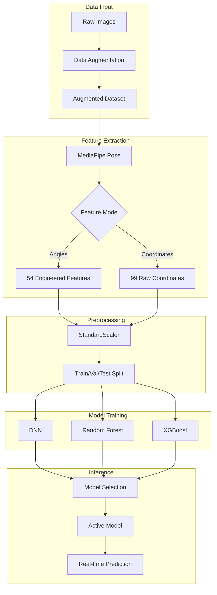

# TuroArnis ML Pipeline Technical Report
**Senior ML Engineer Analysis** | Generated: 2026-01-23

---

## 1. System Architecture



### Data Flow Summary
1. **Input**: Raw pose images organized by class folders
2. **Augmentation**: 15 variations per image using Albumentations
3. **Pose Detection**: MediaPipe Pose (model_complexity=2)
4. **Feature Extraction**: 54 engineered features or 99 raw coordinates
5. **Preprocessing**: StandardScaler normalization, stratified split
6. **Training**: Hyperparameter search with cross-validation
7. **Inference**: Best model selected for real-time prediction

---

## 2. Model Justification Matrix

| Criteria | DNN | Random Forest | XGBoost |
|----------|-----|---------------|---------|
| **Accuracy** | Medium | High | High |
| **Training Speed** | Slow | Fast | Medium |
| **Interpretability** | Low | High | Medium |
| **Overfitting Risk** | High | Low | Low |
| **Tabular Data** | Adequate | Excellent | Excellent |
| **Hyperparameter Sensitivity** | High | Low | Medium |

### Why These Models?

**Random Forest** (Recommended for this task)
- Tabular pose data with 54 structured features
- Robust to overfitting with limited data
- No gradient issues, works out-of-the-box
- Feature importance for interpretability

**XGBoost**
- Gradient boosting often achieves SOTA on tabular data
- Built-in regularization (L1/L2)
- Handles class imbalance well

**DNN (Dense Neural Network)**
- Baseline comparison
- Can capture non-linear relationships
- Requires more data and tuning

> [!IMPORTANT]
> For pose classification with engineered features, **tree-based models (RF/XGBoost) typically outperform neural networks** due to the structured tabular nature of the data.

---

## 3. Preprocessing Pipeline

### 3.1 Data Augmentation
**Tool**: Albumentations library  
**Variations per image**: 15

| Transform Type | Techniques | Probability |
|----------------|------------|-------------|
| Spatial | HorizontalFlip, Affine, ShiftScaleRotate | 90% |
| Color/Lighting | RandomBrightnessContrast, HueSaturationValue, ColorJitter | 80% |
| Camera Simulation | GaussNoise, GaussianBlur, MotionBlur, ImageCompression | 50% |
| Lighting Effects | RandomShadow, RandomToneCurve, CLAHE | 30% |
| Grayscale | ToGray | 10% |

### 3.2 Feature Extraction (54 Features)

| Category | Count | Features |
|----------|-------|----------|
| Joint Angles | 15 | Elbow, shoulder, wrist, hip, knee, ankle, arm-raise, torso |
| Cross-Body Angles | 4 | Diagonal body angles, arm crossing |
| Relative Positions | 18 | Wrist/hand/foot positions relative to body center |
| Distances | 8 | Hand-hand, arm extension, knee/foot spread |
| Symmetry | 5 | Left-right angle differences |
| Body Proportions | 4 | Arm span, body height ratio, stance depth |

### 3.3 Normalization
```python
scaler = StandardScaler()
X_train = scaler.fit_transform(X_train)
X_val = scaler.transform(X_val)
X_test = scaler.transform(X_test)
```

---

## 4. Experimental Setup

### 4.1 Data Split Strategy
| Set | Percentage | Purpose |
|-----|------------|---------|
| Training | 80% | Model learning |
| Validation | 10% | Hyperparameter tuning |
| Test | 10% | Final evaluation |

**Stratification**: Yes (maintains class distribution)

### 4.2 DNN Configuration

| Parameter | Value |
|-----------|-------|
| Architecture | 256 → 128 → 64 → 32 → softmax |
| Optimizer | Adam (lr=0.001, weight_decay=1e-5) |
| Epochs | 500 (with early stopping) |
| Batch Size | 16 |
| Dropout | 0.4 → 0.3 → 0.2 → 0.1 |
| Regularization | L2 (1e-4) + LayerNorm |
| Early Stopping | patience=50, monitor=val_accuracy |
| LR Schedule | ReduceLROnPlateau (factor=0.2, patience=20) |

### 4.3 Random Forest Configuration

| Parameter | Search Space |
|-----------|--------------|
| n_estimators | [200, 300, 400, 500] |
| max_depth | [10, 15, 20] |
| min_samples_split | [2, 5] |
| min_samples_leaf | [1, 2] |
| criterion | ['gini', 'entropy'] |
| **Total Combinations** | 96 × 3-fold CV = 288 fits |

### 4.4 XGBoost Configuration

| Parameter | Search Space |
|-----------|--------------|
| n_estimators | [200, 300, 400, 500] |
| max_depth | [3, 4, 5, 6, 8, 10] |
| learning_rate | [0.01, 0.05, 0.1, 0.15] |
| subsample | [0.7, 0.8, 0.9, 1.0] |
| colsample_bytree | [0.6, 0.7, 0.8, 0.9] |
| **Search Method** | RandomizedSearchCV (30 iterations) |
| **Total Fits** | 30 × 3-fold CV = 90 fits |

---

## 5. Performance Analysis

### 5.1 Evaluation Metrics

| Metric | Description |
|--------|-------------|
| Accuracy | Overall correct predictions / total |
| Precision | TP / (TP + FP) per class |
| Recall | TP / (TP + FN) per class |
| F1-Score | Harmonic mean of precision and recall |

### 5.2 Confusion Matrix Interpretation

The confusion matrix (saved to `confusion_matrix.png`) shows:
- **Diagonal**: Correct predictions (higher = better)
- **Off-diagonal**: Misclassifications
- **Common confusions**: Similar poses may have overlap

### 5.3 Training History Analysis

The training curves (saved to `training_history.png`) reveal:
- **Convergence**: Loss should decrease, accuracy increase
- **Overfitting indicators**: Val loss increasing while train loss decreases
- **Early stopping trigger**: When val_accuracy stops improving

### 5.4 Key Observations

> [!TIP]
> **Best Practices Observed**
> - 3-fold CV provides reliable accuracy estimates
> - GridSearch for RF explores full parameter space
> - RandomizedSearch for XGBoost balances speed vs coverage
> - Automatic model versioning prevents overwriting

> [!WARNING]
> **Potential Issues to Monitor**
> - Class imbalance: Some poses may have fewer samples
> - Similar poses: Strike #1 vs Strike #2 may confuse model
> - Mediapipe failures: Some images may not detect poses

---

## 6. Recommendations

### Immediate Improvements
1. **Ensemble**: Combine RF + XGBoost predictions via voting
2. **5-fold CV**: More reliable accuracy for final model selection
3. **Feature Selection**: Remove low-importance features

### Future Enhancements
1. **Temporal Features**: If using video, add motion/velocity
2. **Pose Sequence Models**: LSTM/Transformer for movement patterns
3. **Active Learning**: Focus annotation on misclassified poses

---

## 7. File References

| Component | File |
|-----------|------|
| DNN Training | [training.py](file:///c:/Users/HP/Documents/GitHub/TuroArnis/training/training.py) |
| RF/XGBoost Training | [training_alt.py](file:///c:/Users/HP/Documents/GitHub/TuroArnis/training/training_alt.py) |
| Feature Extraction | [feature_extraction.py](file:///c:/Users/HP/Documents/GitHub/TuroArnis/training/feature_extraction.py) |
| Data Augmentation | [data_augmentation.py](file:///c:/Users/HP/Documents/GitHub/TuroArnis/training/data_augmentation.py) |
| Model Manager | [model_manager.py](file:///c:/Users/HP/Documents/GitHub/TuroArnis/training/model_manager.py) |
| Feature Documentation | [features_list.txt](file:///c:/Users/HP/Documents/GitHub/TuroArnis/training/features_list.txt) |
